# Introduction

Claude Code represents a shift in how developers interact with AI coding assistants. Unlike traditional tools that focus on line-by-line code completion, Claude Code is a fully agentic assistant designed for building features, writing entire functions and files, and fixing complex bugs simultaneously. It works with any development environment - whether you use VS Code, Cursor, Xcode, JetBrains IDEs, Emacs or Zed.

# Getting Started

## Installation

You can find the up-to-date installation guide here:

https://code.claude.com/docs/en/quickstart

Here’s a quick summary of the steps:

**Step 1**: Install Claude Code using a single command in your terminal

**Step 2**: Log in to your Claude account or connect using an API key with pre-paid credits

**Step 3**: Open your project folder and start Claude Code:

```bash
cd /path/to/your/project
claude
```

## Initial Setup

There are a few recommended setup steps to optimize your Claude Code experience:

1. Run the `/terminal-setup` command to enable **Shift+Enter** for new lines, so you don’t need to use backslashes when entering multi-line prompts:

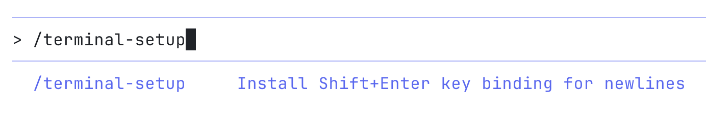

2. Use the /config command to set your Claude Code preferences. The key change is to set the default model to “opus” or “sonnet” (Claude’s smartest models) instead of “haiku” (Claude’s fastest model).

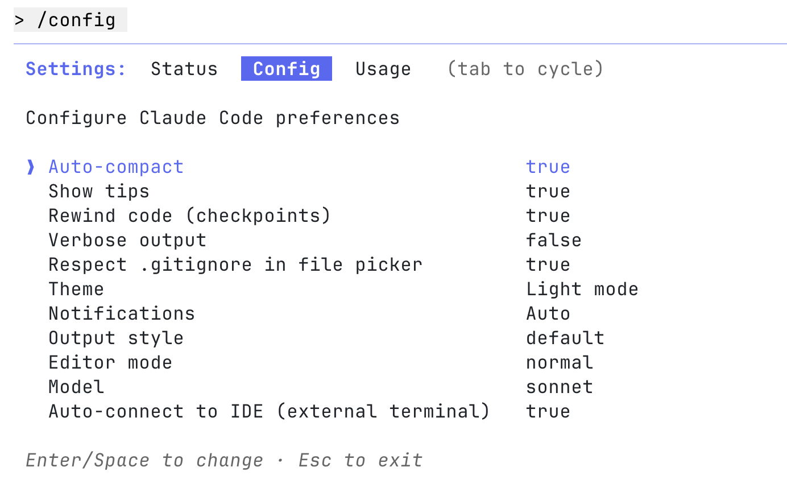

I also suggest turning on **Auto-connect to IDE** and setting it to true. This lets Claude Code automatically access the file you’re working on or the lines you’ve selected in your IDE.

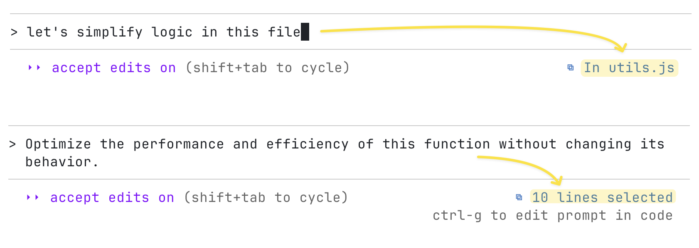

If you prefer using Claude Code directly inside your IDE instead of the terminal, you can follow these setup guides:

- **VS Code (and compatible editors like Cursor):**
  Setup guide: https://code.claude.com/docs/en/vs-code
  Extension: https://marketplace.visualstudio.com/items?itemName=anthropic.claude-code
- **JetBrains IDEs (IntelliJ, PyCharm, WebStorm, etc.):**
  Setup guide: https://code.claude.com/docs/en/jetbrains

That said, the **terminal version** still provides the richest and most flexible experience, so it’s worth starting there before switching to an IDE workflow.

Use the `/install-github-app` command to install the GitHub app. After installation, you can tag **@claude** directly in any GitHub issue or pull request to mention it.

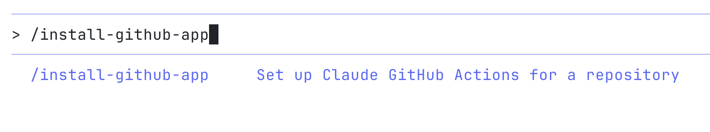

## Code-Based Q&A

The Claude Code team recommends starting with **code-based Q&A** - it’s the fastest and most effective way to learn the tool. Every new technical hire at Anthropic begins with this approach on their first day.

Before Claude Code, onboarding new engineers at Anthropic took two to three weeks. Now, it takes only two to three days. Instead of manually exploring the codebase, new hires can ask Claude Code direct questions about the code and get instant, accurate answers.

**This approach is useful for:**

1. New Claude Code users learning the tool
2. Engineers onboarding to a new codebase

**Examples of Q&A patterns:**

_"How do I run the app locally? What services do I need running?"_

_"Analyze the recent changes in the repository by reviewing the git history. What updates have been added?"_

_"What is the correct branch naming convention for new features and bug fixes?"_

_"How do I make a new API endpoint?"_

_"How do we connect the mobile app to the backend API in a local setup?"_

_"What does `async init { ... }` do on line 123 of `app.ts`?"_

_"Where is the feature flag configuration stored? How do we enable a new flag?"_

_"Where do we validate email addresses? Are there different rules for different user types?"_

_"How do we authenticate with the Stripe API? What credentials do we need?"_

_"What's our rate limiting strategy? How do we prevent abuse?"_

_"Why are we using this weird date formatting everywhere?"_

_"The app crashes when users upload large images. Where does image processing happen?"_

_"How do we handle background jobs? Which queue system do we use?"_

_"What's the difference between `UserService` and `UserManager`? When should I use each?"_

# Essential Key Bindings

Terminal interfaces are minimal by design, which can make features harder to discover. Here are critical key bindings that improve productivity.

**Shift+Tab** - Switch between modes:

- **Auto-accept edits** - automatically applies changes without asking for confirmation
- **Plan mode** - outlines a step-by-step plan before making any changes, so you can review and approve it first

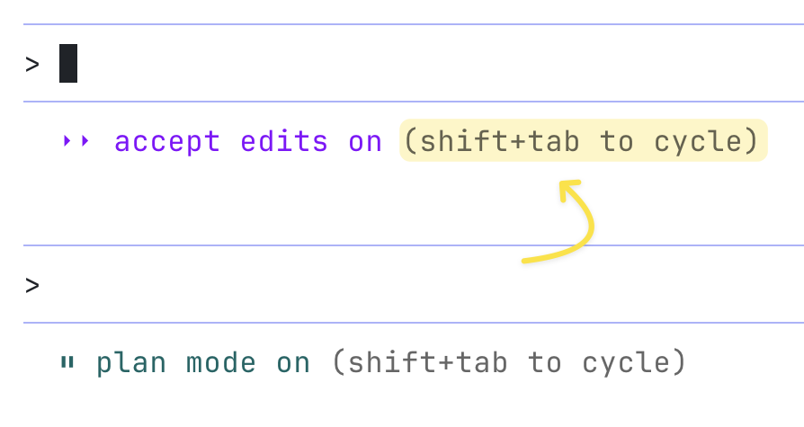

`#` (Pound Sign) - Tell Claude Code to **remember** something. For example, if it's using a tool incorrectly, use `#` to provide correction, and it will learn from it and automatically update the guidance in `CLAUDE.md`.

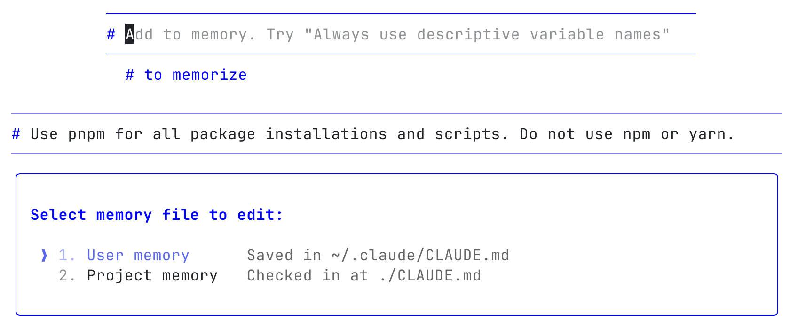

`!` **(Exclamation Mark)** - Switch to Bash mode to run a local command. The command and output go into the context window, making this ideal for long-running commands or any command you want visible to Claude Code on the next turn.

For example, you can run your tests locally, see which ones fail, and then ask Claude Code to fix them. If you plan to run many commands, start with `!` to stay in shell mode. It’s like using your normal terminal - with an AI that can see and help with the results.

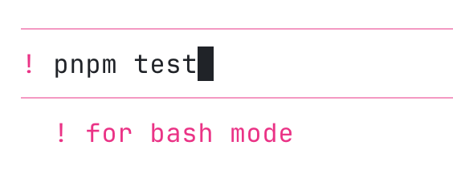

`@` **(At Symbol)** - Mention files and folders to add them to context.

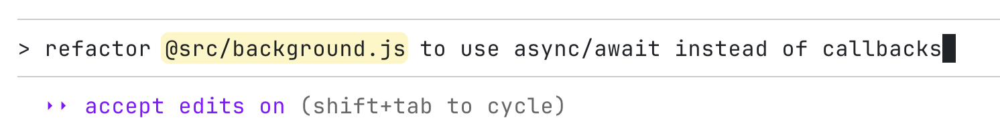

**Escape** - Stop what Claude Code is doing at any time. It's always safe to hit Escape - it won't corrupt the session or cause problems. Use it to interrupt file edits, then provide different guidance, or to stop a suggested edit partway through if most lines look correct but one needs changing.

**Escape Twice** or use the `/rewind` (checkpoint) command to jump back in the conversation history, edit an earlier prompt, and try a different approach.

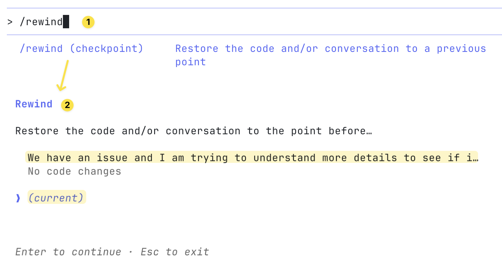

**Ctrl+R** - Search through your prompt history.

**Ctrl+O** - View the raw transcript (everything the model saw).

More details here: https://code.claude.com/docs/en/interactive-mode#general-controls

`?` **(Question mark)** - To see all shortcuts and experiment with them:

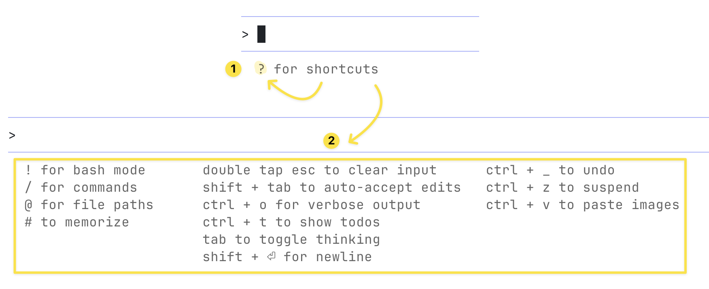

# Resume Previous Sessions

After you end a session, you can restart Claude Code and pick up right where you stopped.

- `claude --continue` to automatically continue the most recent conversation
- `claude --resume` to display a conversation picker

More details here: https://code.claude.com/docs/en/common-workflows#resume-previous-conversations

# Tools

Claude Code's agentic nature means it intelligently combines tools to accomplish tasks.

It operates with a deliberately minimal but powerful tool set:

- **File editing tool**: For making code changes
- **Bash command execution**: For running commands
- **File search**: For exploring the codebase

The model strings these tools together autonomously, exploring code, brainstorming solutions, and making edits without requiring explicit instructions about which tools to use.

Here’s you can check all [Tools available to Claude Code](https://code.claude.com/docs/en/settings#tools-available-to-claude)

# MCP Tools

MCP Tools extend Claude Code with additional tools and integrations.

For example, you can use **Context7 MCP** to give Claude direct access to the latest documentation for the libraries you use. Or you can use **Atlassian MCP** to let Claude retrieve Jira tickets or Confluence pages automatically without copying and pasting anything manually into the terminal. Or **Figma MCP** to let Claude inspect design files, extract them, and implement UI components that match your actual design specs.


Popular MCP tools to use with Claude Code:

- [**Playwright MCP**](https://github.com/microsoft/playwright-mcp) - for browser automation and testing
- [**Context7 MCP**](https://github.com/upstash/context7) - for providing up-to-date code documentation
- [**Atlassian MCP**](https://github.com/sooperset/mcp-atlassian) - for connecting directly with Jira and Confluence
- [**Sentry MCP**](https://docs.sentry.io/product/sentry-mcp/#claude-code) - for error tracking and logs

You can explore more MCP servers in this community collection:

https://github.com/punkpeye/awesome-mcp-servers

**Important:** Having too many active MCPs can quickly fill up the context window, so it’s important to monitor your context usage carefully. When there’s not enough free space left, the model’s performance can drop - results may become less accurate or start to hallucinate more.

Use only the MCPs that are truly necessary. Remove unused ones, or keep them disabled by default and enable them only when your current task requires integration with an additional tool.

You can check your current context usage anytime with the `/context` command.

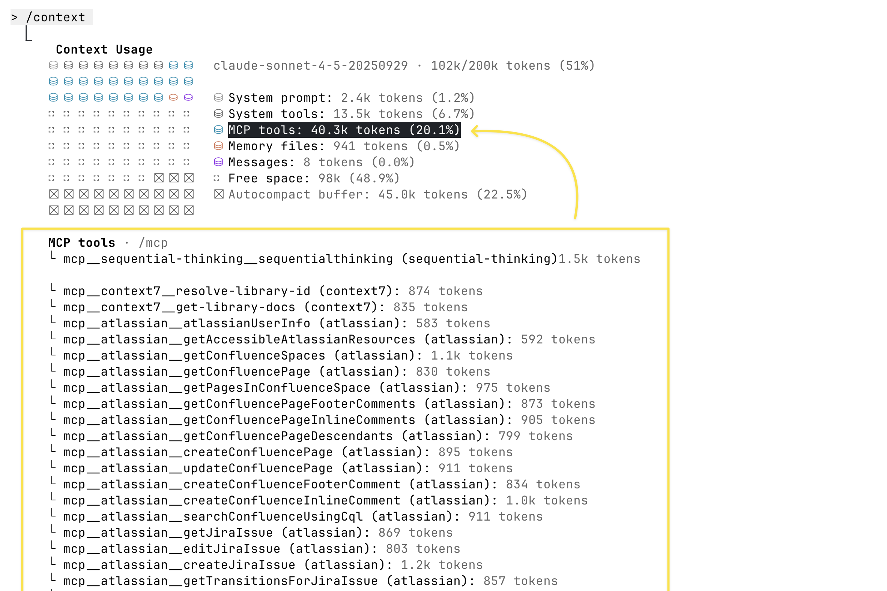

More details about “MCP” are here:

https://code.claude.com/docs/en/mcp

# Permissions

By default, Claude Code asks for permission before doing anything that could change your system - such as writing files, running certain bash commands, or using MCP tools. This cautious design helps protect your environment.

You can control which tools Claude is allowed to use by customizing its “allowlist”. This list lets you safely approve tools you trust, or even enable riskier ones that are easy to undo (like file edits or `git commit`).

After starting Claude Code, you can run `/permissions` command to add or remove tools from the allowlist.

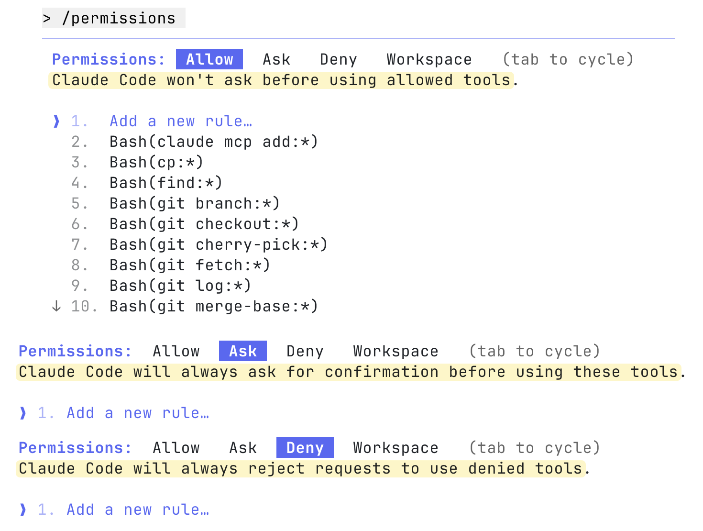

Or edit configuration files manually. You can edit:

- `.claude/settings.json` - recommended check this file into source control so your team shares the same settings, or
- `~/.claude/settings.json` - for personal use only

```json
{
  "permissions": {
    "allow": ["Bash(npm run lint)", "Bash(npm run test:*)", "Read(~/.zshrc)"],
    "ask": ["Bash(rm:*)", "Bash(rmdir:*)"],
    "deny": [
      "Bash(curl:*)",
      "Read(./.env)",
      "Read(./.env.*)",
      "Read(./secrets/**)"
    ]
  }
}
```

More details about “Claude Code settings and permissions” are here:

https://code.claude.com/docs/en/settings

# **Create CLAUDE.md files**

As you work deeper with Claude Code, providing more context leads to smarter decisions. Claude Code offers a hierarchical system for managing context.

## CLAUDE.md

`CLAUDE.md` is a special file that Claude automatically pulls into context when starting a conversation. This makes it an ideal place for documenting:

- Common bash commands
- Code style guidelines
- Testing instructions
- Architectural decisions
- Repository etiquette (e.g., branch naming, merge vs. rebase, etc.)
- Developer environment setup (e.g., pyenv use, which compilers work)
- Any unexpected behaviors or warnings particular to the project
- MCP tools documentation
- Important files and their purposes
- Other information you want Claude to remember

There’s no required format for `CLAUDE.md` files. It’s recommended to keep them concise and human-readable to avoid blowing the context window. For example:

```markdown
# Project Instructions

## Run Commands

- pnpm dev: Local development
- pnpm build: Build the project
- pnpm lint: Run linter
- pnpm test: Run tests

## Package Management

- Use pnpm for package management (not npm or yarn)
- Always use and install the latest versions of all dependencies

## Documentation

Always refer to the latest documentation when working with dependencies:

- Use **context7 MCP** to check the most up-to-date documentation
- Since we use the latest versions of all dependencies, official documentation is the source of truth

# Code style

- Use ES modules (import/export) syntax, not CommonJS (require)
- Avoid magic numbers or strings - use named constants

## Testing

- Keep tests fast and independent so they can run in parallel
- Use integration tests for workflows that combine several modules

## Logging

- Keep logs free of sensitive information
- Log only useful signals, not entire payloads
- Prefer running single tests, and not the whole test suite, for performance

## API Design

- Avoid breaking changes without migration paths
```

The most common places to put your `CLAUDE.md` file are:

- **In your project’s root folder** - `./CLAUDE.md` or `./.claude/CLAUDE.md`
  This is where you usually run `claude` from. It’s best to keep this file in Git so your team can share it across sessions.
- **In your home directory (global memory)** - `~/.claude/CLAUDE.md`
  This makes the file apply to **all** your `claude` sessions on your computer, across every project. It’s your personal setup.

When you run the `/init` command, Claude automatically generates a `CLAUDE.md` file for your project. It’s a useful starting point when you already have an existing codebase - Claude Code analyzes your project and creates the initial file for you. After that, you can manually fine-tune and adjust it as needed.

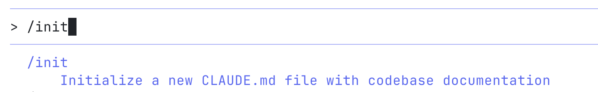

More details about “Manage Claude's memory” are here:

https://code.claude.com/docs/en/memory

## Nested CLAUDE.md

Nested `CLAUDE.md` files live inside subfolders of a project and only apply when Claude works within those specific folders. They build on top of the higher-level `CLAUDE.md`, so you can have custom rules or memory for different parts of your project.

This setup helps keep context specific. For example, your main `CLAUDE.md` might describe general coding rules, while subfolder files add focused guidance for particular domains like mobile or backend.

**Examples**

- `/CLAUDE.md` - project-wide memory, such as coding standards and naming rules
- `/mobile/CLAUDE.md` - adds details for mobile development, like React Native setup or Android build options
- `/api/CLAUDE.md` - defines backend-related rules, such as API schema or Node.js middleware setup

```bash
project/
  CLAUDE.md   # Global instructions
  mobile/
    CLAUDE.md # Mobile-specific instructions. Applies only when working inside mobile folder (merged with parent CLAUDE.md)
  api/
    CLAUDE.md # API-specific instructions. Applies only when working inside api folder (merged with parent CLAUDE.md)
```

When you open Claude inside `/api`, it automatically combines the global `/CLAUDE.md` with the local `/api/CLAUDE.md`. This gives Claude the right context for that folder, making its behavior more accurate and relevant.

## Memory Mode

Use a flexible approach when creating memory files.

If you notice Claude doing something poorly during a chat, you can type the `#` symbol. Then, clearly tell Claude what to remember.

For example, you might say: “Whenever I make code changes, always run the linter with `pnpm lint`”

Claude will then save this rule in the correct memory file you choose and apply it in future interactions.

When writing important instructions, use phrases like “IMPORTANT” or “YOU MUST” to help Claude follow critical rules more reliably.

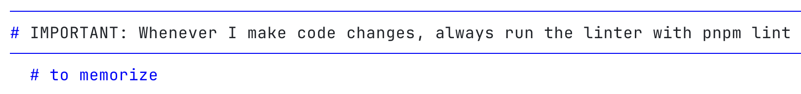

# Manage Chat Context Usage

When a conversation with Claude Code goes on for too long, it can become too large for the model to remember everything clearly. As the chat grows, earlier details can fade or cause confusion.

- `/clear` starts a completely new, fresh conversation with no previous context
- `/compact` summarizes the existing chat and keeps only the most important parts as a new, smaller context
- You can also press **Ctrl+C** to end the current session and then run `claude` again to start a new chat. Your previous conversation will stay saved in the Claude Code history, and you can return to it anytime using `claude --resume`

Using `/compact` helps you stay on topic without losing key points. It replaces the full conversation history with a short, focused summary, so you can continue smoothly without memory issues.

You can also enable **auto-compact** in your config to let Claude manage this automatically:

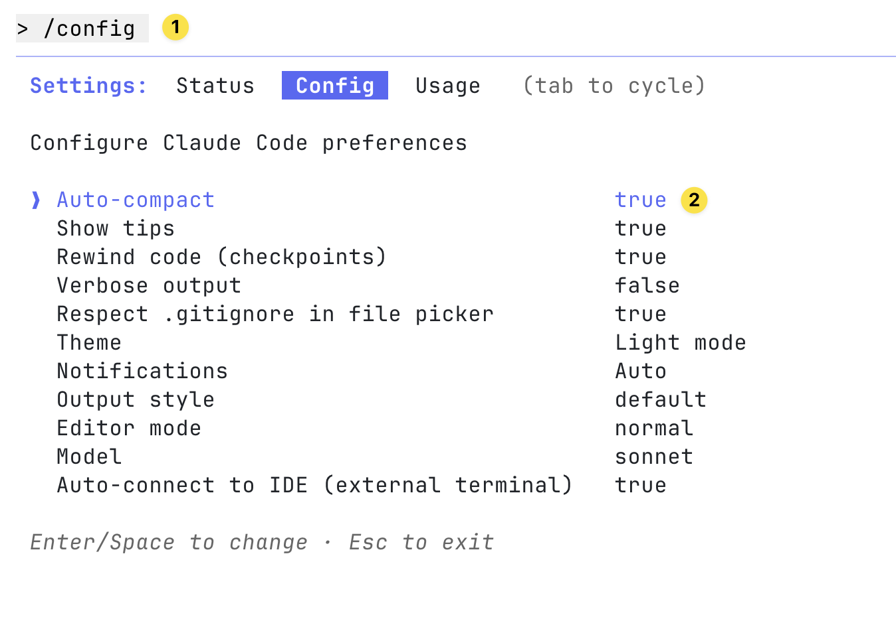

**Important:** As I mentioned in the [**MCP Tools**](https://www.notion.so/Claude-Code-2a958a13ad50803384e2ecd8521216d6?pvs=21) section, it’s very important to keep an eye on your context usage. Many elements can quietly take up space in the context, such as the system prompt, tools, MCPs, `CLAUDE.md` files, your ongoing chat history. When there’s less free space left, the model’s performance can drop. **Use `/clear`, `/compact`, or start a new session regularly to get better results and reduce hallucinations.**

You can use the `/context` command to see how much context is currently being used in your session:

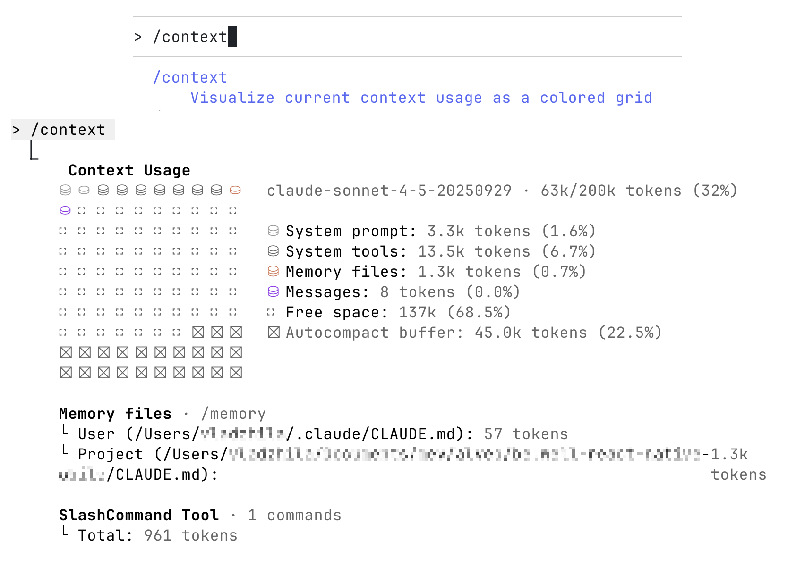

# Workflow Patterns

## Easy Tasks: Automated Workflow

For quick, well-defined tasks like generating tests or fixing small bugs, you can let Claude operate with minimal supervision. Tasks can be run in parallel across several codebase checkouts. In this setup, Claude works autonomously - developers might trigger commands in a terminal, enable auto-accept mode, and return later once Claude reports completion. This hands-off approach streamlines repetitive, low-risk tasks.

## Complex Tasks: Collaborative Workflow

Most engineering work still requires more involvement. In these cases, Claude runs directly inside the IDE terminal, working alongside the developer. The AI may handle a major portion of the implementation, but when it encounters uncertainty or produces imperfect code, the developer refines the result manually. This creates a fluid handoff between automation and human judgment.

Over time, developers learn where each task lies on this spectrum - there's a learning period as developers calibrate their understanding of what Claude can accomplish, what it can one-shot versus two-shot, and how the interaction should flow. This calibration must be refreshed with each model release, as capabilities continuously grow and Claude can handle increasingly complex tasks correctly on the first attempt.

## Plan Mode

The most important technique is asking Claude to make a **plan** before it starts coding.

When developers first use Claude Code, they sometimes request a large, complicated feature and become frustrated when Claude doesn't implement it as imagined. A better approach is to ask Claude to plan first and get approval before implementation.

The Claude Code team strongly recommends this because asking Claude to immediately build a huge feature can lead to results that don’t match what you intended. The simplest way to get accurate output is to **let it think first** - have it brainstorm ideas, outline a plan, and ask for your approval before coding.

You can use the **plan mode** feature (**Shift+Tab**) or simply ask Claude Code directly, for example:

_“Let’s start with a plan. Before writing any code, please brainstorm the best approach, outline the main steps, and ask for my approval before you begin coding.”_ - Claude will handle the planning step automatically.

_“Here's the problem I want to solve. Before you code, brainstorm some ideas and make me a list of ideas for how to approach it, and don't write any code yet.”_ - Claude will present multiple options, allowing the developer to select or combine the best approaches before giving the green light to start coding. Claude is generally quite good at following these instructions.

**Boundary concept:**

The “plan mode boundary” marks the limit between what the model can handle autonomously and what still needs human guidance. As models improve (e.g., Sonnet 3 → 3.5 → 3.7 → 4 → 4.5), this boundary expands - newer versions infer structure and intent from shorter prompts, reducing the need for detailed plans.

Each release absorbs more of this planning logic, making some tasks (like multi-file edits or API work) one-shot. Eventually, plan mode may fade entirely as Claude learns to plan automatically. For now, it remains very useful, often **doubling** or **tripling** success rates on complex tasks.

## Extended Thinking

To take this approach further, developers can ask Claude to use extended thinking. This works best when Claude already has context - asking it to think without any context isn't effective, similar to how humans can't productively think about problems without information.

Extended thinking is disabled by default in Claude Code. You can enable it on-demand by using **Tab** to toggle Thinking on, or by using prompts like “**think**” or “**think hard**” to activate extended thinking mode. This gives Claude more time to carefully evaluate different options before responding. Each phrase increases the depth of reasoning:

**“think” < “think hard” < “think harder” < “ultrathink”**

Higher levels give Claude a larger thinking budget meaning it can analyze more possibilities in detail.

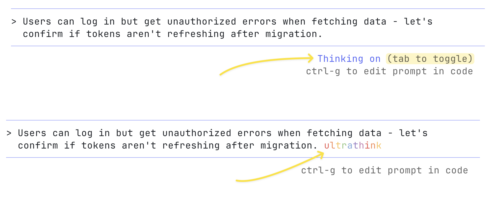

If the response from this step looks good, you can then ask Claude to create a Markdown document summarizing its plan. This way, you’ll have a clear checkpoint to return to if the later implementation doesn’t go as expected.

Keep it simple. For quick edits, don’t overthink. For hard problems, enable extended thinking (use the longer reasoning window).

## Working with Images

You can paste images directly into Claude Code. Just copy the image or drag a file into your Terminal - it’ll automatically attach to your next message.

This is useful when you want to show something visual, like a small UI change or screenshot of bug or logs for debugging.

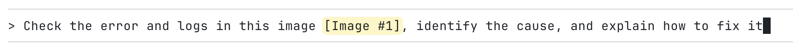

A common workflow is to drag in a UI mockup image, ask Claude Code to implement it, and use a Playwright MCP server for automatic testing and design iteration.

## **Custom Slash Commands**

There are [Built-in slash commands](https://code.claude.com/docs/en/slash-cmds#built-in-slash-cmds) like `/config`, `/context`, `/mcp` and many others. You can also create your own custom slash commands for repeated workflows and store prompt templates in Markdown files:

- **Project commands** are stored in `.claude/commands` inside your project folder. These can be shared with your teammates through version control
- **Personal commands** are stored in `~/.claude/commands`. They’re available in every project you work on

These become available through the slash commands menu when you type `/`.

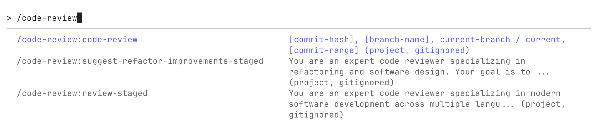

You can check these commands into git to make them available for the rest of your team.

Custom slash commands can include the special keyword `$ARGUMENTS` to pass parameters from command invocation.

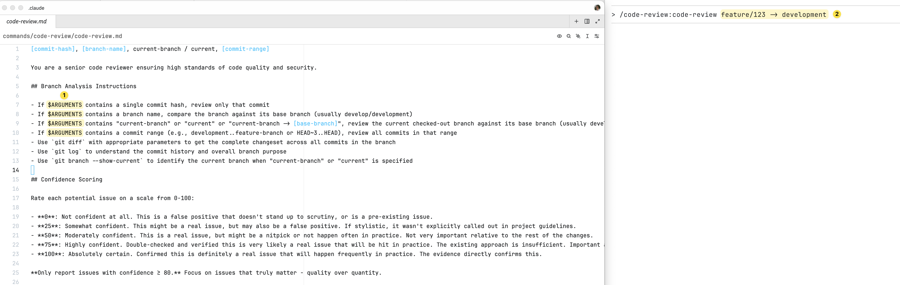

So if you notice that you’re typing the same prompt again and again, that’s a good sign you should turn it into a custom command - it saves time and keeps your workflow consistent.

I use custom commands often for things like:

- Reviewing code by sending a commit hash or branch name
- Reviewing my staged changes
- Suggesting refactors for staged changes
- Generating commit messages for staged changes
- Doing feature or detailed analysis
- Creating QA notes for staged files
- And other repetitive tasks

More details about “Custom slash commands” are here:

https://code.claude.com/docs/en/slash-cmds#custom-slash-cmds

## Subagents


You can create [specialized subagents](https://code.claude.com/docs/en/sub-agents) to handle different parts of a large workflow. Each subagent focuses on a single task, which helps manage context better and lets multiple processes run in parallel.

Subagent has its own system prompt, role, tools, and context window - keeping the main chat clean and focused.

It is stored as a Markdown file with YAML frontmatter that defines its purpose and permissions:

- **User subagents** are stored in `~/.claude/agents`. They’re available in every project you work on
- **Project subagents** are stored in `.claude/agents` inside your project folder. These can be shared with your teammates through version control

Subagents can be called automatically. To enable automatic delegation, use clear and descriptive `description` fields. You can include calls to different subagents inside custom slash commands for orchestrations. For example, one subagent can write the code, another can generate tests for that code, and a third can verify everything and perform a code review.

**Examples of subagents:**

- **code-reviewer** - checks code for bugs, security problems, and best practices
- **test-writer** - writes unit tests, integration tests for new features
- **doc-updater** - updates README files, API docs
- **refactor-agent** - improves or reorganizes code while keeping the same behavior
- **bug-fixer** - finds, reproduces, and fixes specific issues
- **feature-implementer** - builds new features following given specifications
- **security-auditor** - looks for security risks, hardcoded secrets, and unsafe patterns
- **performance-optimizer** - improves code speed and efficiency

More details about “Subagents” are here:

https://code.claude.com/docs/en/sub-agents

## Hooks

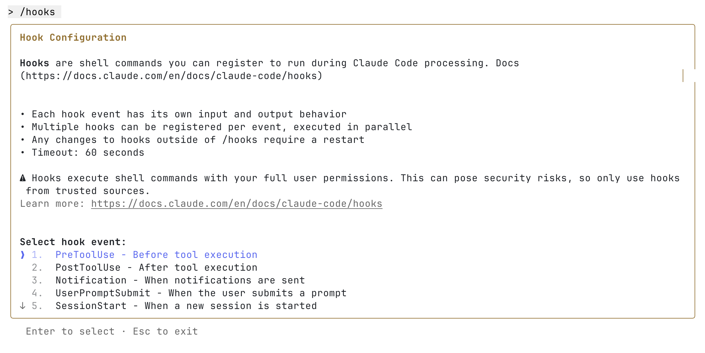

Hooks in Claude Code are custom shell commands that run automatically at certain points in its workflow. They let you customize what happens before or after Claude runs a command - giving you more control over the process.

For example, you can use hooks to:

- **Send notifications** - set up custom alerts when Claude Code is waiting for your input or approval to run something
- **Format code automatically** - run `prettier` on `.ts` files every time a file is edited
- **Automate retries** - if Claude returns failing tests, automatically send the command “keep going until tests pass”

In short, hooks help you automate repetitive actions and make your development flow smoother.

More details about “Hooks” are here:

https://code.claude.com/docs/en/hooks-guide

https://code.claude.com/docs/en/hooks

## Parallel Workflows

Power users often run several Claude Code sessions at the same time. There are two common ways to do this:

- **Multiple Repository Checkouts** - rather than waiting for Claude to complete each step make several copies of the same repository to run separate Claude Code sessions in parallel:
  1. Create several git checkouts in separate folders
  2. Open each folder in separate terminal tabs
  3. Start Claude Code in each folder with different tasks
  4. Cycle through to check progress and approve/deny permission requests
- **Git Worktrees** – use Git worktrees to keep sessions isolated while still working within the same repository. More details here: \*\*https://code.claude.com/docs/en/common-workflows#run-parallel-claude-code-sessions-with-git-worktrees

Anthropic is improving support for parallel workflows, but these methods already let power users work on multiple tasks. Claude Code can handle any number of sessions at once without limits.

# **Tips & Tricks**

- Use **plan mode** more often; it greatly improves complex-task success rates ([Plan Mode](https://www.notion.so/Claude-Code-2a958a13ad50803384e2ecd8521216d6?pvs=21))
- Add a **settings.json** to your repo to pre-approve tools or block unsafe ones ([Permissions](https://www.notion.so/Claude-Code-2a958a13ad50803384e2ecd8521216d6?pvs=21))
- Avoid using “dangerous skip permissions” (YOLO mode). The flag `claude --dangerously-skip-permissions` bypasses all permission checks and lets Claude run without asking for approval. This is unsafe and can lead to risky or destructive actions, so it’s better not to use it
- **Invite Claude to ask questions.** You can say: “We’re brainstorming - ask me questions if you’re unsure.” this makes collaboration more human-like and produces better plans
- **Prototype first, then refine.** When you’re unsure about a feature, let Claude implement it badly on purpose*.* Seeing the mistakes clarifies what you actually want. Then clear the context and redo it properly - a faster version of “throwaway prototyping”
- **Save knowledge in** `CLAUDE.md`**.** When something goes wrong, use `#` to record it there. This builds a simple memory system that keeps track of recurring issues, tests, and linting rules. Later, Claude can automatically refer to this information when similar problems come up again ([Memory Mode](https://www.notion.so/Claude-Code-2a958a13ad50803384e2ecd8521216d6?pvs=21))
- Avoid adding too much text into `CLAUDE.md` without checking if it actually helps the model perform better. Test and refine to find what gives the best results
- Create **custom slash commands** for repetitive tasks like code reviews, generating commit messages, and doing detailed analysis ([Custom Slash Commands](https://www.notion.so/Claude-Code-2a958a13ad50803384e2ecd8521216d6?pvs=21))
- Extend Claude Code with **MCPs** to give Claude only the tools that are truly necessary. Enable MCPs only when you need them to reduce context usage ([MCP Tools](https://www.notion.so/Claude-Code-2a958a13ad50803384e2ecd8521216d6?pvs=21))
- Use `/context` command to monitor context usage
- `/clear` starts a fresh chat, `/compact` shrinks the current one by keeping only the key points, and you can also press Ctrl+C to end the current session and then run `claude` again to start a new chat
- **Edit previous messages.** Press **Escape twice** or use `/rewind` command to jump back and edit your last message. To return to an earlier session, start Claude with the `claude --resume` flag to view and reopen **past chats**
- Paste specific URLs alongside your prompts for Claude to fetch and read. To avoid permission prompts for the same domains, use `/permissions` to add domains to your allowlist
- **Try phase-by-phase workflow.** Start with a `REQUIREMENTS.md` that lists detailed requirements and the full stack (client, server, database, etc.) details. Outline all phases in the same document (you can use an LLM for this as well). The agent implements each phase step by step; you review, guide, do manual parts when needed, mark each phase as complete in the document, and commit after each phase. For the next phase, open a new chat with a message like: “Phase 1 has been completed and committed to the repository. We’re now ready to move forward with Phase 2 - see `@REQUIREMENTS.md` for details.”

# **Stay Updated**

Claude Code offers many more features. I **highly recommend** reading the Claude Code documentation - it’s well written, nicely concise, and full of useful tips, tricks, and best practices to make your workflow more efficient: https://code.claude.com/docs.

Claude Code keeps getting new features, and the team ships updates very often.

Use the `/release-notes` command or check the changelog at https://github.com/anthropics/claude-code/blob/main/CHANGELOG.md to see what’s new.

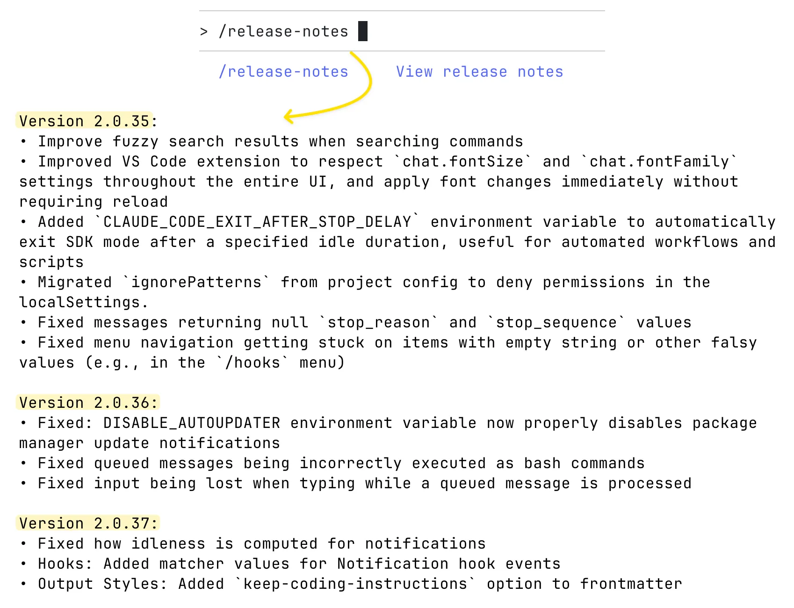

You can also follow these accounts to stay up to date with new releases and announcements:

https://www.youtube.com/@anthropic-ai/videos

https://x.com/AnthropicAI

https://x.com/claude_code

https://x.com/_catwu

https://x.com/alexalbert__

# Claude Code vs Cursor

As of now, these are the two most popular options for AI-assisted development - let’s compare both and see what makes each of them strong in their own way.

## Two philosophies

- Claude Code is agent-style and CLI-first.
- Cursor is IDE-first inside VS Code.

## Main benefits of Claude Code over Cursor

- **Works with any IDE, not just VS Code.** Developers can stay in JetBrains, Neovim, Xcode, Zed, or any editor they prefer - Claude Code runs from the terminal and doesn’t force a specific environment. I know more than one case where developers use their preferred non-VS Code editor (like JetBrains or Xcode) but keep Cursor open in parallel just for agent tasks. For that kind of setup, Claude Code is usually a much better fit, since it can integrate smoothly into any environment without relying on a secondary IDE window.
- **Built directly on the Claude Agent SDK.** This deep integration allows it to use Anthropic’s internal optimization systems fully, without the translation layers that third-party tools like Cursor require. The Claude Code team understands the internal mechanics of their models, knows how to fine-tune them, and how to design better system prompts and tools to get the best possible output. They also have access to private insights and optimizations that external tools like Cursor simply don’t.
- **Models are deeply optimized for Claude Code.** Claude Sonnet was post-trained specifically for Claude Code, which makes it perform more intelligently and efficiently in this environment than anywhere else. That means its performance in Claude Code is uniquely tuned - and doesn’t fully carry over to other tools. Developers who use Claude Sonnet in both environments notice a big difference: in Cursor, it tends to be overly ambitious, often generating hundreds of unnecessary lines of code, while inside Claude Code, the same model feels much smarter and more efficient.
- **Focused model lineup.** Claude Code relies on just 3 main models - Opus, Sonnet, and Haiku. This narrow focus enables deeper system prompt tuning and tighter optimization.
- **Large 200k-token context window by default.** It can handle long codebases, large reasoning chains, and big refactors without losing context - no need to enable special “Max mode” like in Cursor.
- **Cursor’s focus is spread across many models.** While Cursor supports multiple LLMs (GPT, Claude, Gemini, Grok, etc.), this broad focus can limit how deeply it’s optimized for any one of them, giving Claude Code an advantage in consistency and quality.

## Main benefits of Cursor over Claude Code

- **Deep VS Code integration.** For those who like and live in VS Code, Cursor feels completely natural. It’s built directly on top of Visual Studio Code, offering a seamless experience where all AI features - chat, diffs, and completions are integrated into the familiar environment.
- **Instant inline completions.** Cursor’s tab-completion engine is one of its strongest features, providing fast, context-aware suggestions while typing. It’s ideal for developers who prefer to mix manual editing with AI assistance.
- **Accept/Reject workflow.** Every AI-generated change appears in a diff view where you can accept, reject, or modify edits line by line.
- **Visual diffs and editing comfort.** The side-by-side diff view makes it easy to review, compare, and fine-tune code safely, reducing the risk of unwanted changes during refactors or AI-assisted edits.
- **Supports multiple top models.** Cursor works with GPT-5, Claude (Sonnet, Opus), Gemini 2.5 Pro, and xAI’s Grok Code, and others, giving developers flexibility to choose the model that best fits each task.
- **All-in-one interface.** Chat, edit, review, and commit directly within the same window - no context switching.
- **Great for quick fixes and iterative edits.** While Claude Code excels at reasoning across large projects, Cursor shines in the fast, iterative cycle of writing, testing, and polishing small to medium tasks.

## A practical way to use both

**The hybrid approach:**

- **Cursor Pro ($20/mo)** + **Claude Max 5x ($100/mo)** = **$120/mo**.
- This is cheaper than **Cursor Ultra ($200/mo)** while providing complementary strengths.

**Typical split of work:**

- **Claude Code**: build features end-to-end, run large refactors, coordinate changes across modules, reason over complex systems, handle long context.
- **Cursor**: polish quick edits, fast bug fixes, inline and tab completions inside the IDE.

As one developer summarized it: “Claude Code builds the house; Cursor paints the walls.”

# Claude Code Pricing and Usage

You can find all the details about pricing here:

- Main Pricing Page: https://www.claude.com/pricing
- Claude Code Pricing: https://claudelog.com/claude-code-pricing/
- Using Claude Code with Pro or Max plans: https://support.claude.com/en/articles/11145838-using-claude-code-with-your-pro-or-max-plan
- Max Plan Overview: https://www.claude.com/pricing/max

### Quick recommendation

- Start with **Claude Code Pro ($20)** - it can be enough for most developers, especially if you combine it with other tools like Cursor or Codex. You might sometimes hit usage limits.
- If you reach rate limits often, upgrade to **Claude Code Max 5x ($100)**.
- For power users who work full-time with Claude Code (heavy code generation, large reviews, complex subagent orchestrations, frequent UltraThink use, or multiple terminals running in parallel), go for **Claude Code Max 20x ($200)**.

### Popular setups with Cursor

- **Cursor ($20) + Claude Code ($20)** - a balanced setup. Let Claude Code handle most agent tasks. If you hit Claude Code limits, use Cursor Agents until the Claude Code limit resets. Cursor Tabs completion is great for manual edits/refactors, though sometimes a bit aggressive.
- **Cursor ($20) + Claude Code Max 5x ($100)** - “unlimited-feel” Cursor Tabs for smooth manual edits plus stronger Claude Code agent with large limits.

### Notes

There are other similar tools - like **Codex**, **Gemini CLI**, or **OpenCode**. You can mix them if it helps your workflow or provides better coverage for specific tasks.

# Conclusion

AI tools like Claude Code help engineers work faster, focus on solving complex problems, and spend less time on repetitive coding tasks. This shift lets developers think more creatively and strategically. Claude Code leads this change, constantly improving to support developers and expand what’s possible with AI-assisted programming.

# **Useful Sources**

**Claude Code (official documentation):**

https://code.claude.com/docs

**Claude Code: Best practices for agentic coding:**

https://www.anthropic.com/engineering/claude-code-best-practices

**Claude Code (common workflows):**

https://code.claude.com/docs/en/common-workflows
