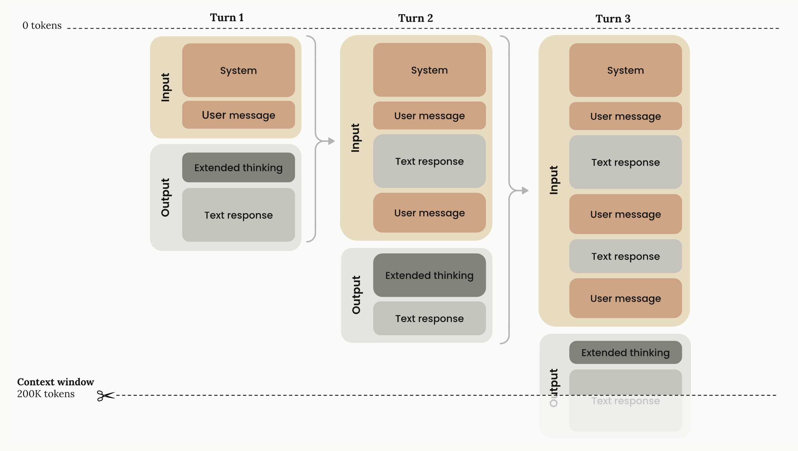
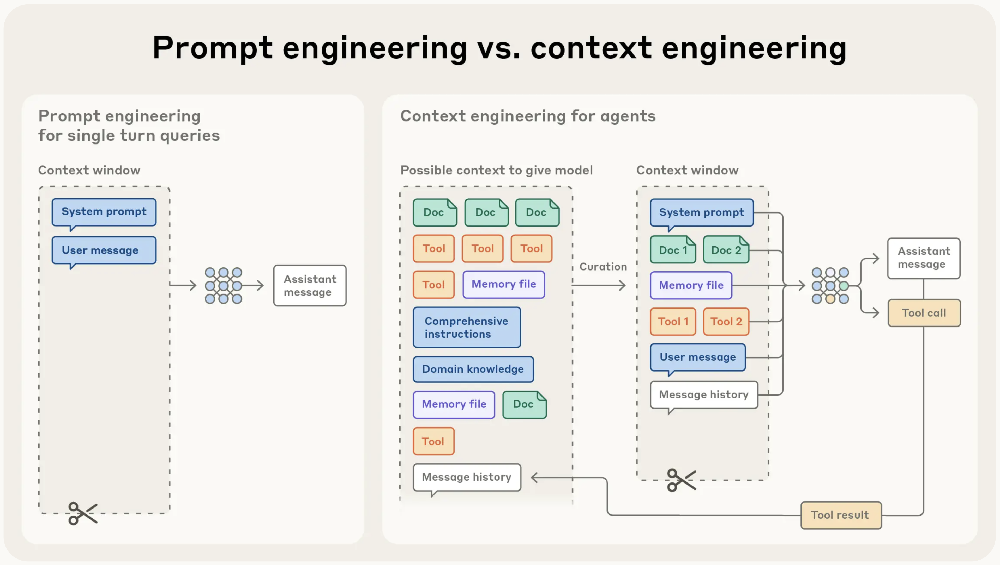

# Context Window

Before moving on to Context Engineering, let's briefly look at and remind ourselves what the context window is.

The context window is the model’s working memory - the amount of text it can “see” at one time.

It includes everything sent to the model within the current conversation: your previous messages, the assistant’s replies, the current input and output, and any extra context such as system prompt, external documents, tool calls and tool responses.

This is different from training data. Training data is huge and static, while the context window is small and dynamic. It exists only while the model is working on our request.

Every message you send and every response from the assistant is added to this live buffer. Token usage grows in a straight line: more turns → more tokens.

Every model has a fixed, hard-coded context window limit (e.g., 200k tokens for Claude Sonnet 4.5, 400k for GPT-5.1, 1M for Gemini models). Once the total reaches the limit, nothing else can fit. At that point, the system either drops some older content (for example, by summarizing the conversation) or throws an error.

LLMs can’t handle unlimited text. More context consumes more memory and slows down processing. Performance drops as context grows*.*

Models struggle to retrieve information buried deep inside long conversations. This is the “needle in a haystack” problem. Even models with giant limits can still fail to use that information effectively.

Image source: <a href="https://platform.claude.com/docs/en/build-with-claude/context-windows">Context windows</a>

# Prompt vs Context Engineering

**Prompt engineering** is about crafting effective instructions for an LLM.

**Context engineering** is about selecting and managing all the information placed in the model’s context window - not just prompts, but every token the model sees.

Image source: <a href="https://www.anthropic.com/engineering/effective-context-engineering-for-ai-agents">Effective context engineering for AI agents</a>

# Context Engineering

Context engineering is the skill of giving an LLM exactly the information it needs, at the right time, so it can solve the task in front of it. It goes far beyond writing a single prompt. You are designing the entire context window: instructions, examples, RAG, state, tools, history, and the snapshots you carry into future chats.

This term applies both to those who effectively use LLM and to those who build LLM-powered applications (e.g. Cursor, Claude Code), because in both cases the outcome depends on how well the context is prepared.

When this is done well, the model behaves like a reliable system instead of a guessing machine.

**The balancing act**

You decide what enters the context, what gets removed, what gets summarized, and what gets carried forward. Too little information and the model guesses. Too much or irrelevant information and the model loses focus, costs go up, and results degrade. Different LLMs have different strengths, limitations, and context window sizes, so part of the craft is knowing how each model behaves and how to tailor the context for it.

More context is not always better. Better context is better.

Context engineering has a skill side and an intuition side.

**The skill side**

The skill side includes the building blocks: clear task descriptions, prompt techniques, roles, few-shot examples, RAG for fetching external data, multimodal inputs, tool calls, history management, compacting large inputs, and monitoring context usage. It also includes practical systems work: storing context snapshots so a new chat can continue where the previous one stopped, maintaining long-term project memories, managing MCPs and agents with their own roles and states, and orchestrating workflows across multiple steps.

**The intuition side**

The intuition side is knowing how much context is enough, what the model will actually pay attention to, how to balance detail and brevity, and how to choose the right model for a specific moment. This intuition guides decisions like whether to include an example, whether to summarize a section, or whether a model should call a tool instead of generating text.

**Context orchestration**

In real workflows, context engineering becomes orchestration. You break work into flows, decide which outputs feed the next step, choose where tools or RAG fit, and run verification loops like generate → evaluate → fix → retry. You pack the context window efficiently, keep only the information needed for the current step, and maintain continuity across sessions through stored snapshots and global memories. You coordinate agents and MCPs, enforce guardrails, and monitor context size so nothing important gets pushed out.

**Context drives results**

Everything the model does depends on the context you construct. The model's weights stay the same, but well engineered context leads to better results.

# Recommendations

Recommendations for better context engineering.

**Use the context window wisely:** The context window is limited, so every part of it should matter. Do not fill it with long or repeated text. Make it clean and efficient so the model can focus and give accurate results.

**Keep context at the right size:** The model needs the right amount of information to work well. If the context has too little, the model starts guessing. If it has too much, the model gets distracted and the results get worse. Include only the information the model truly needs for the task. The intuition for what is “enough” usually develops over time.

**Verify information before adding it:** If a wrong detail enters the context, it can spread and create more mistakes later. Always check important information before you save it. Start a new conversation if the context becomes incorrect. Delete outdated information.

**Summarize context:** A large context window does not always help. After many turns, replace older messages with a short summary of goals and key facts.

**Use tools wisely:** Too many tools or long tool descriptions confuse the model. Use only the tools needed for the current task. A small and clear tool list helps the model choose the right tool.

**Put critical information at the edges:** Models pay the most attention to the start and the end of the context. Information in the middle gets less attention. For coding agents, this means: the first system prompt matters a lot, the most recent user request also matters, long and messy history in the middle becomes noise. Place key details at the top or near the end so the model stays focused. Read about it here: [Lost in the Middle: How Language Models Use Long Contexts](https://arxiv.org/abs/2307.03172)

**Use small examples:** Examples help the model learn better than long explanations. The key is choosing the right examples, not many examples. Use a few short examples that match the task and avoid long lists of rare or unusual cases.

**Keep memory clean:** Files like AGENTS.md, rules, or other global memory can help the model, but they can also overload it if they become too large or unclear. Keep these files simple, organized, and up to date.

**Fix bad steps early using checkpoints and rewinds:** If the model goes in the wrong direction, do not continue the conversation on top of the mistake. Go back to an earlier point, edit the prompt, or restart from a clean checkpoint. This prevents the error from spreading through the context and makes the model’s next steps more accurate.

**Load info only when needed:** Modern agents don’t need all the information in the context from the start. They can explore the environment and load data only when it becomes necessary. Instead of placing large blocks of text into the context, you can point to file paths, URLs, query templates, or references. Then the agent pulls the real details at runtime through tools such as search, APIs, or file reads. This works the same way people think: we don’t remember every detail, but we know where to find the information when we need it.

**Add support layers:** This recommendation is mainly for people building LLM-powered applications. Good context engineering is not only about the context itself. You also need extra layers that support and protect the system. Use guardrails to stop unsafe actions, use evaluations to catch mistakes early, apply security checks, and use caching and prefetching to save time and reduce cost.

# Recommended Reading

https://x.com/karpathy/status/1937902205765607626

https://www.anthropic.com/engineering/effective-context-engineering-for-ai-agents

https://www.philschmid.de/context-engineering

https://www.promptingguide.ai/guides/context-engineering-guide

https://www.datacamp.com/blog/context-engineering

https://platform.claude.com/docs/en/build-with-claude/context-windows
