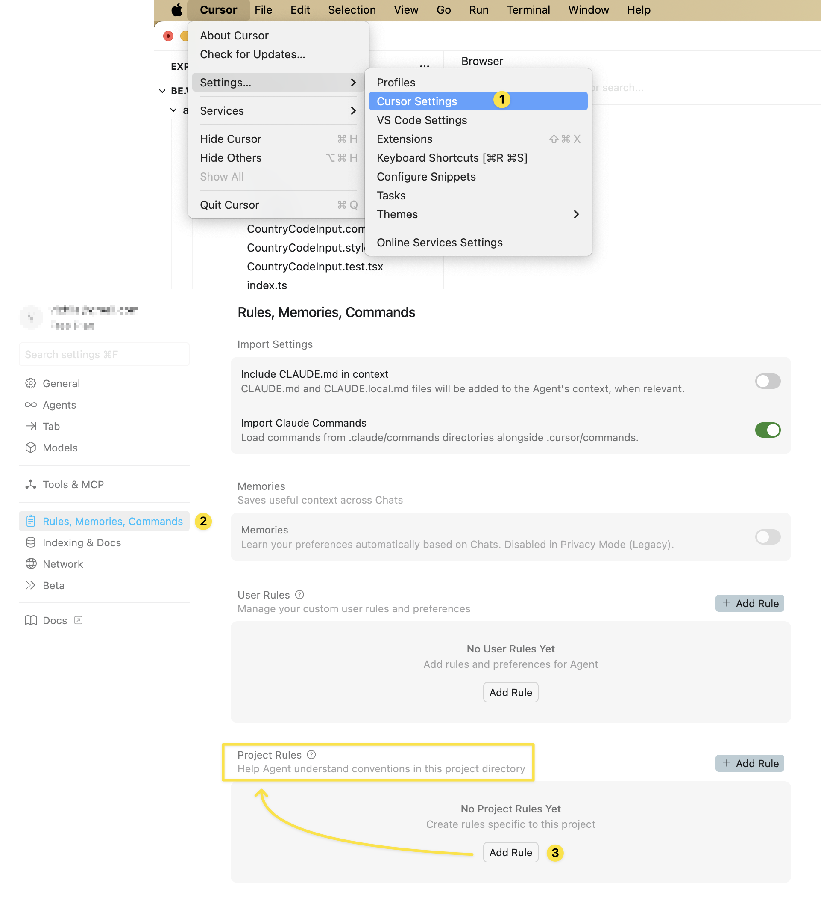
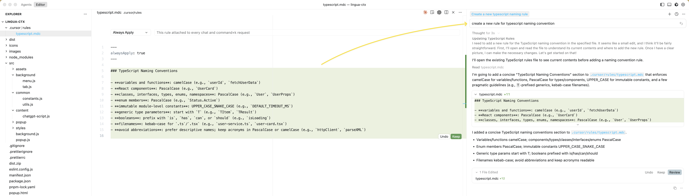
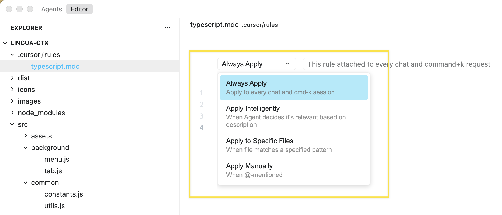
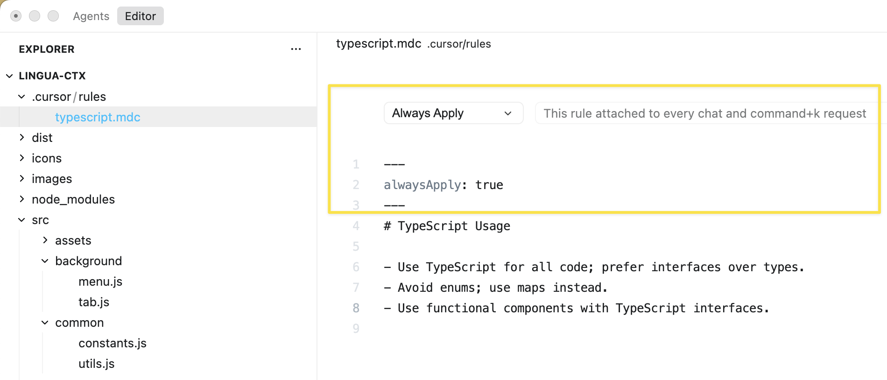
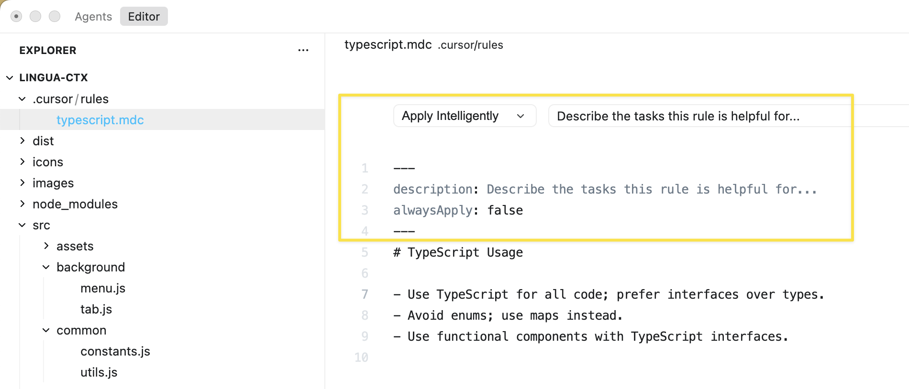
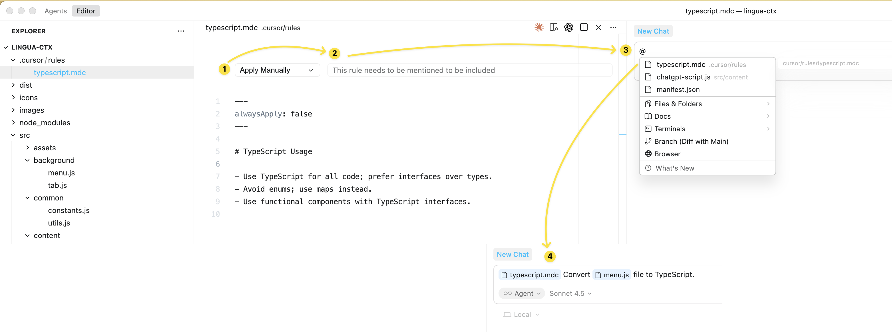
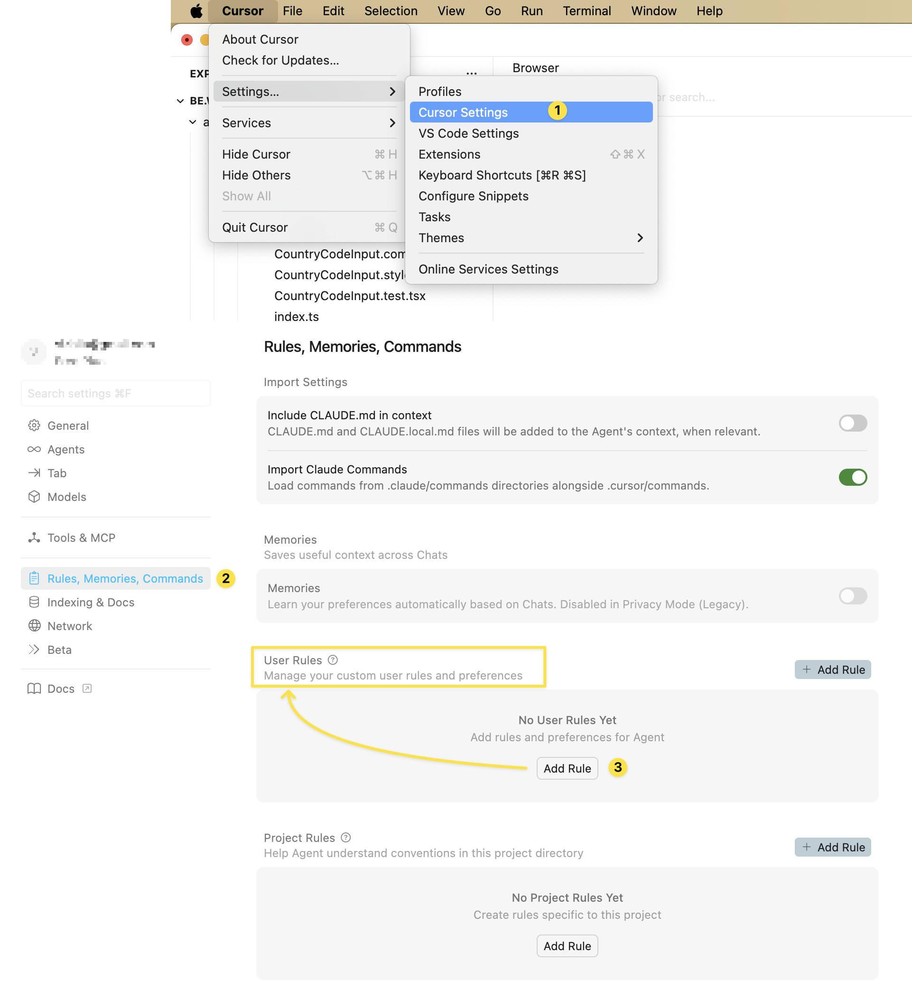
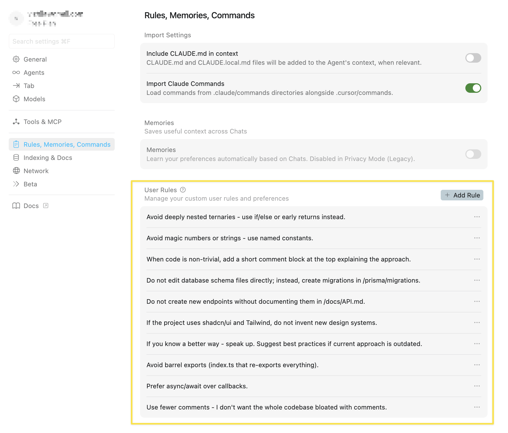

## Why Cursor Rules Matter

Cursor Rules are permanent instructions that help an AI coding assistant understand your specific project. They teach the AI about your code structure, style, and how you like to work - so it can act like an expert teammate instead of starting from scratch every time.

Without Rules, you have to keep explaining the same things and fixing the same mistakes again and again. With Rules, the AI remembers your standards, keeps your code consistent, runs commands, and takes care of repetitive work automatically.

It’s recommended to set up Rules when starting a new project. This way, everything the AI creates will follow your standards from the start, saving you time and effort later.

> Note: This idea isn’t unique to Cursor - similar features exist in Claude Code, Codex, GitHub Copilot, and other AI coding tools. It’s quickly becoming the normal way to work with AI assistants. So learning it is useful not just for Cursor, but for AI coding tools in general.

Cursor Rules provide system-level instructions to [**Agent**](https://cursor.com/docs/agent/overview) and [**Inline Edit**](https://cursor.com/docs/inline-edit/overview) (but not [Cursor Tab](https://cursor.com/docs/tab/overview)). They are persistent context, preferences, or workflows for your projects.

Large language models don't retain memory between completions. Rules provide persistent, reusable context at the prompt level.

When applied, rule contents are included **at the start of the model context**. This gives the AI consistent guidance for generating code, interpreting edits, or helping with workflows.

## Types of rules

Cursor supports 4 types of rules:

**Project Rules**

Stored in `.cursor/rules`, project-specific, version-controlled and scoped to your codebase.

**User Rules**

Plain text, global to your Cursor environment, apply everywhere. Defined in settings and always applied.

**Team Rules**

Team-wide rules managed from the dashboard. Available on Team and Enterprise plans.

**AGENTS.md**

Agent instructions in markdown format. Simple alternative to `.cursor/rules`.

> Note: The single `.cursorrules` (legacy) file in the project root was Cursor's original approach. It’s still supported but **will be deprecated**. Cursor Team recommends migrating to **Project Rules** or to **AGENTS.md**.

## Project rules

Project rules are stored in `.cursor/rules` and serve as instructions that teach the AI model how to work with the specific project. Each rule is a separate file that's version-controlled alongside your code.

**Rules can be:**

- **Scoped** using path patterns to apply only to specific files
- **Invoked** manually when needed
- **Auto-included** based on relevance to your current work
- **Always included** to apply across all contexts in your project

Subdirectories can have their own `.cursor/rules` directory, automatically scoped to that folder and its contents.

**Use project rules to:**

- Encode domain-specific knowledge about your codebase
- Automate project-specific workflows or templates
- Standardize style or architecture decisions

### Creating Project Rules

**Option 1: Via Cursor Settings**

Navigate to **Cursor Settings → Rules** and add rules:



**Option 2: Manual Setup**

Create the directory in your project root:

```bash
mkdir -p .cursor/rules
```

**This directory should be committed to Git to ensure consistency across your team.**

**Option 3: Command Palette**

1. Open Command Palette: **Cmd+Shift+P** (Mac) or **Ctrl+Shift+P** (Windows/Linux)
2. Type and select **"New Cursor Rule"**
3. Cursor generates a template `.mdc` file where you define `description`, `globs`, `alwaysApply` and instructions

**Option 4: Ask the AI**

You can simply ask the agent in chat to create a new rule for you:



### Deep Dive into Project Rules: The MDC Format

The Metadata Content (MDC) format uses a two-part structure: a YAML frontmatter block for metadata configuration, followed by a standard Markdown section for the detailed instructions and examples.

```yaml
---
description:
globs: [Array of file path patterns]
alwaysApply: [boolean: true/false]
---
# Detailed Instructions and Code Snippets (Markdown Content)
```

MDC frontmatter controls how rules are injected into the LLM context and activated for use.

**Key Properties:**

- `description`: This mandatory summary provides a brief, actionable overview of the rule's content. For certain rule types, the AI agent uses this description to **decide** if the rule is **relevant** before requesting the **full content**, saving context space and processing time.
- `globs`: File path patterns (e.g., `src/**/*.ts`). If the currently active file matches one of these patterns, the rule is injected into the context.
- `alwaysApply`: When `true`, injects the rule unconditionally into the model context, regardless of active file or user query.

**Important:** Excessive rule length (>500 lines) or too many `alwaysApply: true` rules can **overwhelm the LLM**. Use targeted **Apply Intelligently** or **Apply Manually** rules instead of blanket **Always Apply** rules for large instruction sets.

### MDC Rule Types and Activation Logic



**Always Apply** - always included in model context; automatically available in all chats:



**Apply Intelligently** - AI automatically decides whether to include it based on `description` and user intent:



**Apply to Specific Files** - Included when active file matches a glob pattern (e.g., `frontend/**/*.tsx`):


**Apply Manually** - Only included when explicitly mentioned in chat using `@ruleName`:



**Creating a comprehensive rule system requires strategic organization.** Start with a project-wide general standards file that covers fundamental principles applicable everywhere - code formatting preferences, comment style, naming conventions, and import organization.

Create framework-specific rules next using glob patterns to automatically apply them - a `react-components.mdc` file with `globs: src/components/**/*.tsx` ensures React component guidelines only apply when working on components.

Add domain-specific rules for different parts of your application - `api-patterns.mdc` for backend API code, `database-queries.mdc` for database interaction code, `ui-accessibility.mdc` for frontend user interface work.

Include testing standards in a dedicated rule that ensures consistent test structure, naming, and coverage requirements.

Here’s a set of example **Project Rules** to help spark ideas for your experiments:

```markdown
project/
├── .cursor/
│ └── rules/
│ ├── general-standards.mdc # Always applied fundamentals
│ ├── typescript-conventions.mdc # TypeScript-specific rules
│ ├── git-workflow.mdc # Commit and PR conventions
│ ├── backend/
│ │ ├── api-design.mdc # RESTful API patterns
│ │ ├── authentication.mdc # Auth implementation rules
│ │ └── database.mdc # Database query standards
│ └── frontend/
│ ├── react-components.mdc # React component structure
│ ├── styling.mdc # CSS/Tailwind guidelines
│ └── accessibility.mdc # A11y requirements
```

For large applications or monorepos, organize rules hierarchically. Place `.cursor/rules` directories inside subdirectories (e.g., `backend/`) to automatically scope rules to that specific sub-tree, preventing conflicts across tech stacks:

```
project/
├─.cursor/rules/          # Global project rules
│  ├─ naming.mdc
│  └─ architecture-overview.mdc
├─ backend/
│  ├─.cursor/rules/       # Backend-scoped rules
│  │  └─ rpc-template.mdc
│  └─ server.py
└─ frontend/
   ├─.cursor/rules/       # Frontend-scoped rules
   │  └─ component-style.mdc
   └─ app.tsx
```

## User Rules

User rules are global preferences defined in **Cursor Settings → Rules** that apply across **all projects**. They're **plain text** and perfect for setting preferred communication style or coding conventions.

This is how you can add **User Rules** in Cursor:



Here’s a set of example **User Rules** to help spark ideas for your experiments. Feel free to add your own specific preferences. Take the time to experiment and see what leads to the most reliable instruction-following from the model.

Rules from the screenshot below for easy copy-pasting:

```markdown
- Avoid deeply nested ternaries - use if/else or early returns instead.
- Avoid magic numbers or strings - use named constants.
- When code is non-trivial, add a short comment block at the top explaining the approach.
- Do not edit database schema files directly; instead, create migrations in /prisma/migrations.
- Do not create new endpoints without documenting them in /docs/API.md.
- If the project uses shadcn/ui and Tailwind, do not invent new design systems.
- If you know a better way - speak up. Suggest best practices if current approach is outdated.
- Avoid barrel exports (index.ts that re-exports everything).
- Prefer async/await over callbacks.
- Use fewer comments - I don't want the whole codebase bloated with comments.
```



## **Team Rules**

For Cursor’s Team or Enterprise plans, there is an option to manage team-wide rules via the Cursor dashboard (cloud settings). Team Rules are shared across organization so that every member of the team has the same base rules applied by default.

This is useful for enforcing organization-level standards (like security requirements or commit message formats) in addition to project rules. Team rules are administered by team owners/admins and distributed automatically to all team members through the tool.

You can read more about **Team Rules** in the official Cursor documentation: [https://cursor.com/docs/context/rules#team-rules](https://cursor.com/docs/context/rules#team-rules)

## AGENTS.md

`AGENTS.md` is a simple markdown file for defining agent instructions. Place it in your project root as an alternative to `.cursor/rules` for straightforward use cases.

While **Project Rules** use the MDC format for granular control, `AGENTS.md` is a simple, unstructured Markdown file without metadata or complex configurations. It **lacks** the frontmatter configuration, meaning it cannot use `globs` or `alwaysApply` for targeted scoping.

```markdown
# Project Instructions

## Code Style

- Use TypeScript for all new files
- Prefer functional components in React
- Use snake_case for database columns

## Architecture

- Follow the repository pattern
- Keep business logic in service layers

## Package Management

- Use pnpm for package management (not npm or yarn)
- Always use and install the latest versions of all dependencies

**Important:**

- Do **not** manually add packages to `package.json` with hardcoded or random versions
- Always use package manager commands to ensure consistent and up-to-date dependency versions

## Documentation

Always refer to the latest documentation when working with dependencies:

- Use **context7 MCP** to check the most up-to-date documentation
- Since we use the latest versions of all dependencies, official documentation is the source of truth

## UI Components (shadcn/ui)

- Always use the CLI to install shadcn/ui components
- Do **not** manually copy component code or add components to the codebase

You can also use @filename.ts to include files in your rule's context.
```

It applies to the **directory or subdirectory** where it’s placed. For complex, monorepos that require fine-grained rules - such as applying React component standards only to the `frontend/` directory and Django rules only to `backend/` - the MDC format offers better flexibility. It’s the preferred choice for advanced configuration.

### Nested AGENTS.md support

You can place `AGENTS.md` files in any **subdirectory** of your project, and they will be automatically applied when working with files in that directory or its children.

This allows for more granular control of agent instructions based on the area of your codebase you're working in:

```json
project/
  AGENTS.md     # Global instructions
  frontend/
    AGENTS.md   # Frontend-specific instructions
    components/
      AGENTS.md # Component-specific instructions
  backend/
    AGENTS.md   # Backend-specific instructions
```

Instructions from nested `AGENTS.md` files are combined with those in parent directories, and **more specific instructions take priority**.

### Priority Between AGENTS.md and .cursor/rules

There is no official documentation that explicitly states which file takes priority when there's conflicting information between `.cursor/rules` and `AGENTS.md`. The documentation suggests they're meant to be complementary rather than conflicting.

**Recommendation**

Given that both are loaded together, **avoid conflicts** by using them for different purposes:

- Use `AGENTS.md` for high-level project instructions, setup commands, and general guidelines
- Use `.cursor/rules/*.mdc` for specific, scoped rules that apply to particular file patterns or contexts

## Rule Priority and Conflict Handling

When different rule types conflict, Cursor applies them in this order of priority:

**Team Rules → Project Rules → User Rules**

This hierarchy ensures organizational standards override personal preferences.

**Team Rules** enforce mandatory requirements (security, compliance, architecture) at the organizational level.

**Project Rules** manage repository-specific implementation details.

**User Rules** apply individual style preferences without compromising team standards.

## .cursorignore

You can use a `.cursorignore` file in the root project directory to block access to specific files or folders. Anything listed there is excluded from indexing, Tab completions, Agent and Inline Edit actions, and @-symbol code references.

**Why ignore files?**

**Security:** Restrict access to API keys, credentials, and secrets. While Cursor blocks ignored files, complete protection isn't guaranteed due to LLM unpredictability.

**Performance:** In large codebases or monorepos, exclude irrelevant portions for faster indexing and more accurate file discovery.

Cursor automatically ignores files in `.gitignore` and the default ignore list. Default patterns include:

- Environment files: `*/.env`, `*/.env.*`
- Credentials: `*/credentials.json`, `*/secrets.json`
- Keys: `*/*.key`, `*/*.pem`, `*/id_rsa`

You can read more about **Ignore files** in the official Cursor documentation: [https://cursor.com/docs/context/ignore-files](https://cursor.com/docs/context/ignore-files)

## Why Use Rules Even for Large Codebases

The natural question may appear: if we already have a large codebase and start using Cursor, should we still use Cursor Rules? Doesn’t the AI already understand the project’s style and architecture from the existing code?

When Cursor indexes a large codebase, it becomes good at:

- finding files and symbols
- matching similar patterns (e.g., "we use services + DTOs + controllers")
- generating code that looks like existing code

But this is pattern imitation, not understanding. The model can mimic style, but it doesn't know which of patterns are **mandatory** versus **historical** mistakes that simply exist in the codebase.

What the model can’t reliably understand just by reading a large codebase - or may hallucinate about even if it tries:

**1. Current architecture decisions**

Codebase may contain both old and new approaches. The model can't know "we migrated to V2 services - don't use V1 anymore".

**2. Team conventions that aren't reflected in the code**

Things like "all network errors go through this helper", "never return raw DB models from handlers" or "we log this way for audits". These are often in people's heads or in Confluence, not in code.

**3. Task/context priorities**

The codebase doesn't tell the model: "right now we're focusing on mobile BLE performance, so don't suggest adding heavy logging".

**4. Bad examples in the repo**

Every real project with large codebase has old code - old patterns, experimental folders, quick hotfixes. The model can copy those too because it can't tell which parts of the codebase are "don't use this".

That's why the large codebase ≠ the AI understands the project rules.

With a large codebase, you don't need a 1,500-line rules. You might add a thin rule layer that tells Cursor:

- which patterns are canonical
- which parts of the codebase are legacy
- which files to prefer
- which tools/commands to run
- which approaches to avoid

Rules anchor the model in the **current era** of your project. The codebase contains the past; Cursor Rules tell the AI how to operate in the present.

**The recommend steps for a large existing codebase:**

- Keep rules focused and minimal. Start with simple lines that clarify architecture choices: "prefer X over Y" "this folder is legacy - don’t reuse it"
- Use rules to align the AI with your _current_ architecture and workflow
- Use rules to prevent regression into old patterns

Rules help the AI understand your project the same way developers do: by knowing what matters today, not what happened five years ago.

## Recommended Practices

**Start simple.** Begin with basic instructions. Keep rules clear and short.

**Avoid vague language.** Direct instructions in 150–300 lines work better than 1,500 lines of vague text. Unclear instructions lead to inconsistent results. Say "run `pnpm test` before committing," not "tests should be run."

**Create rules before coding.** When starting a new project, write your rules first. This helps ensure consistency across files from day one and eliminates the need for refactoring later.

**Keep rules updated.** Update your rules when your project, frameworks, or APIs change. This prevents the AI from using outdated patterns or missing new features.

**Add emphasis when needed.** Use markers like "IMPORTANT" or "YOU MUST" to highlight critical instructions.

**Keep rules manageable.** Aim for under 500 lines per file. Excessive length or too many `alwaysApply: true` rules can overwhelm the LLM. Use targeted "Apply Intelligently" or "Apply Manually" rules for comprehensive guidance instead.

**Split into small modules.** Create specific files like `react-standards.mdc`, `api-validation.mdc`, and `testing-pattern.mdc` instead of one giant rule file.

**Show real examples.** Use `@filename` references to point to actual code. Link to good files to follow and bad (legacy) files to avoid. Examples often work better than explanations.

**Use nested rules.** Place `.cursor/rules` or `AGENTS.md` files in subdirectories. Rules automatically apply when files in that directory are used. This keeps guidance specific to each part of your codebase.

**Commit rule files.** If rules aren't in version control, each team member's AI will behave differently. Commit rules to keep your team aligned.

**Get help refining rules.** Use another LLM or Cursor Agent to create or improve your rules.

## Conclusion

Cursor Rules can help transform a general AI into a more reliable assistant for your codebase. They give the model the context it normally forgets: how your project is structured, how you write code, and which workflows matter. It leads to less re-explaining, fewer repeated mistakes, more consistent output.

Use **Project Rules** (in `.cursor/rules`) for codebase-specific standards and workflows. They’re version-controlled, can target files with `globs`, and keep guidance close to the code. Use **User Rules** for your personal style and habits that should apply everywhere. When you want a fast, lightweight setup, add `AGENTS.md` to state clear, high-level instructions without extra metadata.

Keep rules short, direct, written before coding starts, and updated as the project evolves. Split big ideas into small, focused files, show real examples, and avoid vague language. This structure lets the AI choose the right guidance at the right time and helps you and your team get consistent results with less effort.

Rules aren't unique to Cursor - they're becoming standard across AI coding tools. Learning them now prepares you for the future of AI-assisted development, where teaching AI about your project once saves countless hours of repetitive explanation.

## Useful Sources

**Cursor Rules (official documentation):**

[https://cursor.com/docs/context/rules](https://cursor.com/docs/context/rules)

**Reading about AGENTS.md as a README for agents:**

[https://agents.md](https://agents.md/)

**Recommends using these examples as inspiration - review them and adapt what fits your needs:**

[https://cursor.directory/](https://cursor.directory/) - is a community hub where people publish and explore rules.

[https://github.com/PatrickJS/awesome-cursorrules](https://github.com/PatrickJS/awesome-cursorrules) - is a large GitHub collection of rule files for different tech stacks and frameworks.

[https://github.com/sanjeed5/awesome-cursor-rules-mdc/tree/main/rules-mdc](https://github.com/sanjeed5/awesome-cursor-rules-mdc/tree/main/rules-mdc) - is another curated set of rule templates and modular MDC-style rules.
